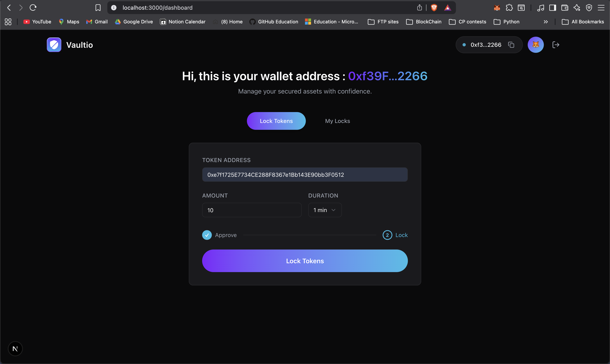
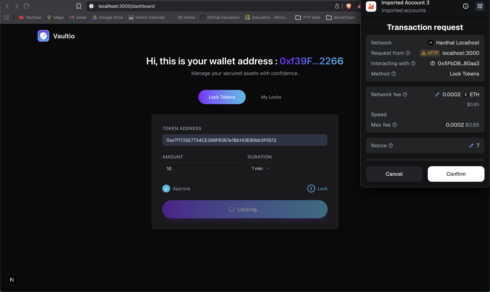
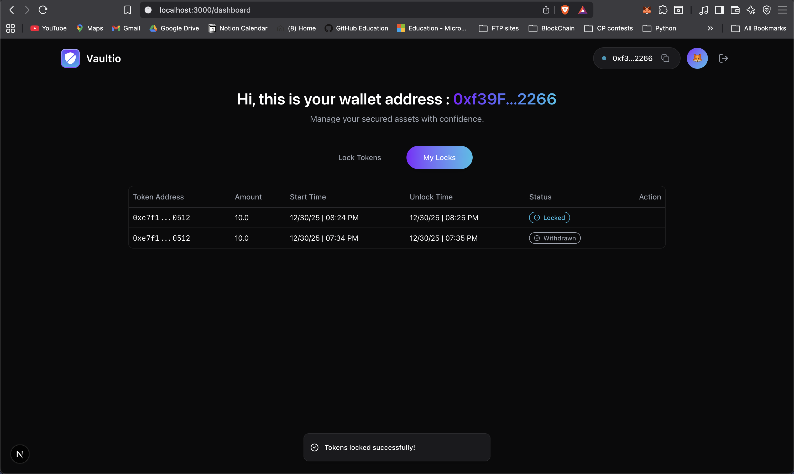
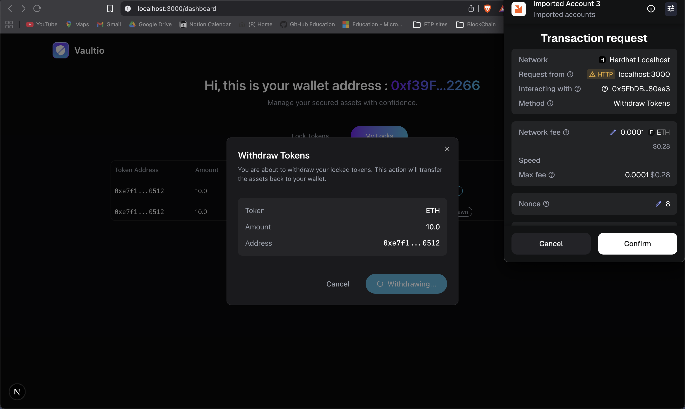
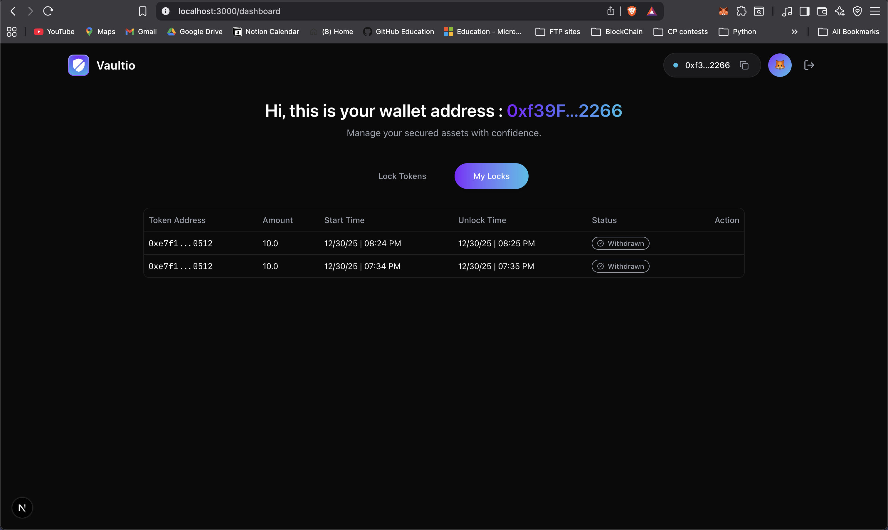
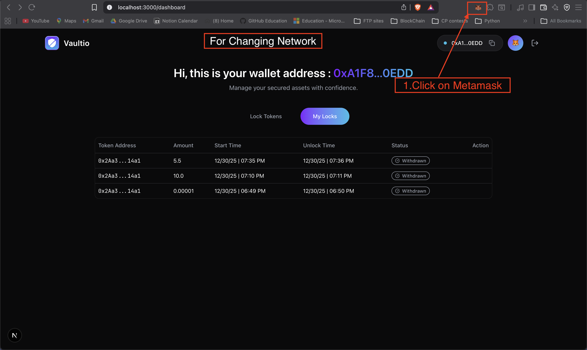
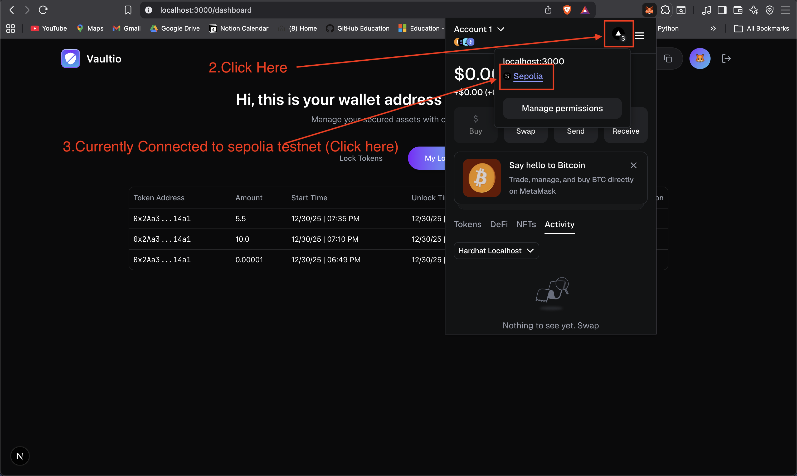
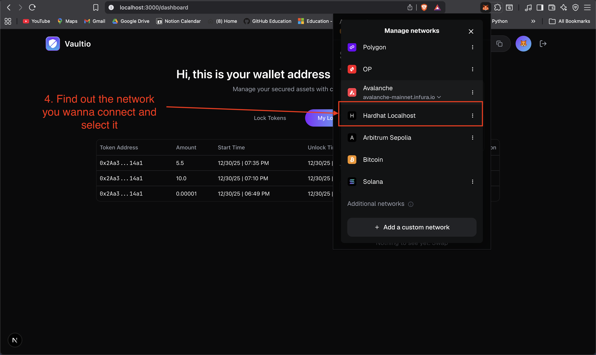
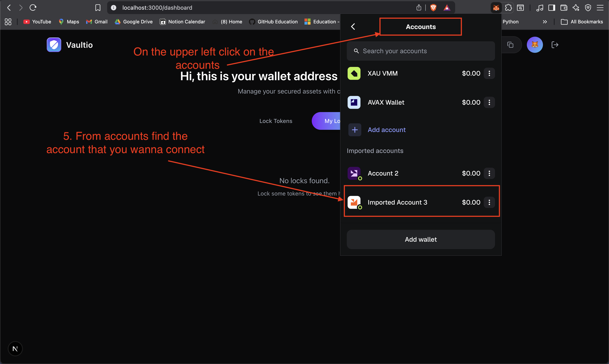

<div align="center">

# Vaultio

**A decentralized token locking vault system built on Ethereum**

[](https://soliditylang.org/)
[](https://hardhat.org/)
[](https://nextjs.org/)
[](https://www.docker.com/)
[](LICENSE)

</div>

---

## Table of Contents

- [Project Overview](#project-overview)
- [Features](#features)
- [Prerequisites](#prerequisites)
  - [Option A: Docker (Recommended)](#option-a-docker-recommended)
  - [Option B: Manual Setup](#option-b-manual-setup)
- [MetaMask Configuration](#metamask-configuration)
- [Project Structure](#project-structure)
- [Quick Start](#quick-start)
  - [Docker Setup (Recommended)](#docker-setup-recommended)
  - [Manual Setup](#manual-setup)
- [Frontend Setup](#frontend-setup)
- [Network Configuration](#network-configuration)
  - [Deployed Contracts (Sepolia Testnet)](#deployed-contracts-sepolia-testnet)
- [Usage Examples](#usage-examples)
- [Screenshots](#screenshots)
  - [Application Features](#application-features)
  - [Network Switching](#network-switching)
- [Development](#development)
- [Security Considerations](#security-considerations)

---

## Project Overview

**Vaultio is a smart contract-based token vault system that provides secure, time-locked storage for ERC-20 tokens. Users can lock their tokens for a customizable duration (specified in minutes), and withdraw them only after the lock period has expired. The system uses OpenZeppelin's SafeERC20 library for secure token transfers and proper error handling.**

### Key Components

<table>
<tr>
<td width="33%">

**Smart Contract**

- Solidity 0.8.28
- OpenZeppelin libraries
- Hardhat framework

</td>
<td width="33%">

**Frontend**

- Next.js 16.1.1
- React 19.2.3
- Wagmi & RainbowKit

</td>
<td width="33%">

**DevOps**

- Docker & Docker Compose
- Makefile automation
- Hot-reload development

</td>
</tr>
</table>

---

## Features

<table>
<tr>
<td>

✓ Lock ERC-20 tokens for specified duration  
✓ Withdraw tokens after lock expiration  
✓ View all user locks and details  
✓ Check withdrawal eligibility

</td>
<td>

✓ Secure transfers using SafeERC20  
✓ Multi-network support  
✓ Modern responsive UI  
✓ Time-based lock enforcement

</td>
</tr>
</table>

---

## Prerequisites

Choose one of the following setup options:

### Option A: Docker (Recommended)

> 🐳 **This is the recommended approach** - No need to install Node.js, pnpm, or manage dependencies manually.

<table>
<thead>
<tr>
<th>Software</th>
<th>Version</th>
<th>Purpose</th>
</tr>
</thead>
<tbody>
<tr>
<td><strong>Docker</strong></td>
<td>v20+</td>
<td>Container runtime</td>
</tr>
<tr>
<td><strong>Docker Compose</strong></td>
<td>v2.0+</td>
<td>Multi-container orchestration</td>
</tr>
<tr>
<td><strong>Make</strong></td>
<td>Any</td>
<td>Command automation</td>
</tr>
<tr>
<td><strong>Git</strong></td>
<td>Latest</td>
<td>Version control</td>
</tr>
<tr>
<td><strong>MetaMask</strong></td>
<td>Latest</td>
<td>Web3 wallet (configured for Hardhat)</td>
</tr>
</tbody>
</table>

### Option B: Manual Setup

> ⚙️ Traditional setup with local Node.js installation.

<table>
<thead>
<tr>
<th>Software</th>
<th>Version</th>
<th>Purpose</th>
</tr>
</thead>
<tbody>
<tr>
<td><strong>Node.js</strong></td>
<td>v20+</td>
<td>JavaScript runtime</td>
</tr>
<tr>
<td><strong>pnpm</strong></td>
<td>v10.26.0+</td>
<td>Package manager</td>
</tr>
<tr>
<td><strong>Make</strong></td>
<td>Any</td>
<td>Command automation</td>
</tr>
<tr>
<td><strong>Git</strong></td>
<td>Latest</td>
<td>Version control</td>
</tr>
<tr>
<td><strong>MetaMask</strong></td>
<td>Latest</td>
<td>Web3 wallet (configured for Hardhat)</td>
</tr>
</tbody>
</table>

---

## MetaMask Configuration

Before using the application, you need to configure MetaMask to connect to the local Hardhat network.

### Step 1: Add Hardhat Network to MetaMask

<table>
<thead>
<tr>
<th>Setting</th>
<th>Value</th>
</tr>
</thead>
<tbody>
<tr>
<td><strong>Network Name</strong></td>
<td>Hardhat Local</td>
</tr>
<tr>
<td><strong>RPC URL</strong></td>
<td><code>http://127.0.0.1:8545</code></td>
</tr>
<tr>
<td><strong>Chain ID</strong></td>
<td><code>31337</code></td>
</tr>
<tr>
<td><strong>Currency Symbol</strong></td>
<td>ETH</td>
</tr>
</tbody>
</table>

**How to add:**

1. Open MetaMask and click on the network dropdown
2. Click "Add Network" → "Add a network manually"
3. Enter the settings from the table above
4. Click "Save"

### Step 2: Import a Hardhat Test Account

When Hardhat node starts, it displays 20 test accounts with pre-funded ETH. Import one of these accounts into MetaMask:

1. Copy a private key from the Hardhat node output (e.g., `0xac0974bec39a17e36ba4a6b4d238ff944bacb478cbed5efcae784d7bf4f2ff80`)
2. In MetaMask, click the account icon → "Import Account"
3. Paste the private key and click "Import"

> ⚠️ **Important:** These are test accounts only. Never use them on mainnet or with real funds.

---

## Project Structure

<details>
<summary><b>View Project Structure</b></summary>

```
Vaultio/
├── docker-compose.yml     # Docker services configuration
├── Makefile              # Root Makefile (Docker commands)
│
├── contracts/             # Smart contract code
│   ├── Dockerfile        # Hardhat container
│   ├── Makefile          # Contract Makefile (manual commands)
│   ├── contracts/        # Solidity contracts
│   ├── scripts/          # Deployment and interaction scripts
│   ├── test/             # Contract tests
│   ├── ignition/         # Hardhat Ignition deployment modules
│   └── hardhat.config.ts # Hardhat configuration
│
├── frontend/              # Next.js frontend application
│   ├── Dockerfile        # Frontend container
│   ├── src/
│   │   ├── app/          # Next.js app router pages
│   │   ├── components/   # React components
│   │   ├── hooks/        # Custom React hooks
│   │   ├── lib/          # Utilities and configurations
│   │   └── abi/          # Contract ABIs
│   └── public/           # Static assets
│
├── screenshots/           # Application screenshots
│
└── README.md             # This file
```

</details>

---

## Quick Start

### Docker Setup (Recommended)

> 🐳 All commands are run from the **project root directory**.

#### Step 1: Clone and Start Containers

```bash
# Clone the repository
git clone https://github.com/roudra323/Vaultio
cd Vaultio

# Start all Docker containers
make up
```

#### Step 2: Start Hardhat Node

```bash
# In a new terminal, start the Hardhat node
make node
```

Keep this terminal running. You'll see output showing 20 test accounts with their private keys.

#### Step 3: Deploy Contracts

```bash
# In another terminal, deploy the Vaultio contract
make deploy-local
```

Save the deployed contract address from the output.

#### Step 4: Deploy Mock ERC-20 Token (Optional)

```bash
# Deploy a mock token for testing (defaults: Mock Token, MTK, 6 decimals)
make deploy-mock

# Or with custom name/symbol/decimals
make deploy-mock TOKEN_NAME="Test Token" TOKEN_SYMBOL="TEST" TOKEN_DECIMALS=18
```

#### Step 5: Mint Test Tokens (Optional)

```bash
# Mint tokens to your address
make mint
```

#### Step 6: Configure Frontend

Now configure the frontend environment variables with the deployed contract addresses. See [Frontend Setup](#frontend-setup) for detailed instructions.

#### Docker Commands Reference

<table>
<thead>
<tr>
<th>Command</th>
<th>Description</th>
</tr>
</thead>
<tbody>
<tr>
<td><code>make up</code></td>
<td>Start all containers in background</td>
</tr>
<tr>
<td><code>make up-build</code></td>
<td>Start containers with rebuild</td>
</tr>
<tr>
<td><code>make down</code></td>
<td>Stop all containers</td>
</tr>
<tr>
<td><code>make logs</code></td>
<td>View logs from all services</td>
</tr>
<tr>
<td><code>make logs-hardhat</code></td>
<td>View Hardhat container logs</td>
</tr>
<tr>
<td><code>make logs-frontend</code></td>
<td>View Frontend container logs</td>
</tr>
<tr>
<td><code>make shell-hardhat</code></td>
<td>Open shell in Hardhat container</td>
</tr>
<tr>
<td><code>make shell-frontend</code></td>
<td>Open shell in Frontend container</td>
</tr>
<tr>
<td><code>make node</code></td>
<td>Start Hardhat node inside container</td>
</tr>
<tr>
<td><code>make stop-node</code></td>
<td>Stop Hardhat node</td>
</tr>
<tr>
<td><code>make compile</code></td>
<td>Compile contracts</td>
</tr>
<tr>
<td><code>make test</code></td>
<td>Run contract tests</td>
</tr>
<tr>
<td><code>make deploy-local</code></td>
<td>Deploy Vaultio contract locally</td>
</tr>
<tr>
<td><code>make deploy-mock</code></td>
<td>Deploy mock ERC-20 token</td>
</tr>
<tr>
<td><code>make mint</code></td>
<td>Mint tokens to an address</td>
</tr>
<tr>
<td><code>make demo</code></td>
<td>Run full demo workflow</td>
</tr>
</tbody>
</table>

---

### Manual Setup

> ⚙️ All commands are run from the **`contracts/` directory** unless specified otherwise.

#### Step 1: Clone and Install Dependencies

```bash
# Clone the repository
git clone <repository-url>
cd Vaultio

# Install contract dependencies
cd contracts
pnpm install

# Install frontend dependencies
cd ../frontend
pnpm install
```

#### Step 2: Start Hardhat Node

```bash
cd contracts
make node
# Or: npx hardhat node
```

Keep this terminal running. Node starts on `http://127.0.0.1:8545`.

#### Step 3: Deploy Contracts

```bash
# In a new terminal
cd contracts
make deploy-local
```

Save the deployed contract address from the output.

#### Step 4: Deploy Mock ERC-20 Token (Optional)

```bash
cd contracts
make deploy-mock

# Or with custom name/symbol/decimals
TOKEN_NAME="Test Token" TOKEN_SYMBOL="TEST" TOKEN_DECIMALS=18 make deploy-mock
```

#### Step 5: Mint Test Tokens (Optional)

```bash
cd contracts
make mint
```

#### Step 6: Configure Frontend

Now configure the frontend environment variables with the deployed contract addresses. See [Frontend Setup](#frontend-setup) for detailed instructions.

#### Manual Commands Reference

<table>
<thead>
<tr>
<th>Command</th>
<th>Description</th>
</tr>
</thead>
<tbody>
<tr>
<td><code>make node</code></td>
<td>Start Hardhat node</td>
</tr>
<tr>
<td><code>make stop-node</code></td>
<td>Stop Hardhat node</td>
</tr>
<tr>
<td><code>make compile</code></td>
<td>Compile contracts</td>
</tr>
<tr>
<td><code>make test</code></td>
<td>Run contract tests</td>
</tr>
<tr>
<td><code>make clean</code></td>
<td>Clean build artifacts</td>
</tr>
<tr>
<td><code>make deploy-local</code></td>
<td>Deploy to localhost</td>
</tr>
<tr>
<td><code>make deploy-sepolia</code></td>
<td>Deploy to Sepolia testnet</td>
</tr>
<tr>
<td><code>make verify</code></td>
<td>Verify contract on Etherscan</td>
</tr>
<tr>
<td><code>make deploy-mock</code></td>
<td>Deploy mock ERC-20 token</td>
</tr>
<tr>
<td><code>make mint</code></td>
<td>Mint tokens to an address</td>
</tr>
<tr>
<td><code>make approve</code></td>
<td>Approve Vaultio to spend tokens</td>
</tr>
<tr>
<td><code>make lock</code></td>
<td>Lock tokens in Vaultio</td>
</tr>
<tr>
<td><code>make withdraw</code></td>
<td>Withdraw tokens from Vaultio</td>
</tr>
<tr>
<td><code>make demo</code></td>
<td>Run full demo workflow</td>
</tr>
</tbody>
</table>

---

## Frontend Setup

> 📝 **This section is the same for both Docker and Manual setup.**

### 1. Configure Contract Address

After deploying the Vaultio contract, you need to configure the frontend with the contract address.

**Environment Variable**

Create or update `frontend/.env.local`:

```env
NEXT_PUBLIC_WALLET_CONNECT_PROJECT_ID=
# Hardhat Local (Chain ID: 31337)
NEXT_PUBLIC_VAULTIO_ADDRESS_LOCAL=0x5FbDB2315678afecb367f032d93F642f64180aa3
# Sepolia Testnet (Chain ID: 11155111)
NEXT_PUBLIC_VAULTIO_ADDRESS_SEPOLIA=0x71Dbf9C7e101FFDDB68e0C6B010099C2e39f998c
```

### 2. Access the Frontend

<table>
<tr>
<td width="50%">

**Docker Setup**

The frontend starts automatically with previously ran command `make up`.

Access at: **http://localhost:3000**

</td>
<td width="50%">

**Manual Setup**

```bash
cd frontend
pnpm dev
```

Access at: **http://localhost:3000**

</td>
</tr>
</table>

### 3. Connect Wallet

1. Open **http://localhost:3000** in your browser
2. Click "Connect Wallet"
3. Select MetaMask
4. Ensure you're connected to the **Hardhat Local** network
5. Select an imported test account

---

## Network Configuration

### Switching Networks in the Frontend

The application uses **RainbowKit** which provides automatic network switching. Simply change your network in MetaMask, and RainbowKit will handle the transition seamlessly.

**How it works:**
1. Open your MetaMask wallet
2. Switch to any supported network (Hardhat, Sepolia, or Mainnet)
3. The frontend automatically detects and adapts to the network change

> 💡 **See it in action:** Check out the [network switching screenshots](screenshots/network-change/) demonstrating the automatic network detection.

### Supported Networks

The following networks are configured in `frontend/src/lib/wagmi.ts`:

<table>
<thead>
<tr>
<th>Network</th>
<th>RPC URL</th>
<th>Chain ID</th>
<th>Purpose</th>
</tr>
</thead>
<tbody>
<tr>
<td><strong>Hardhat Local</strong></td>
<td><code>http://127.0.0.1:8545</code></td>
<td>31337</td>
<td>Local development</td>
</tr>
<tr>
<td><strong>Sepolia Testnet</strong></td>
<td>Public RPC</td>
<td>11155111</td>
<td>Testing & demos</td>
</tr>
<tr>
<td><strong>Ethereum Mainnet</strong></td>
<td>Public RPC</td>
<td>1</td>
<td>Production</td>
</tr>
</tbody>
</table>

### Adding a New Network

<details>
<summary><b>Frontend Configuration</b></summary>

To add a new network, edit `frontend/src/lib/wagmi.ts`:

```typescript
import { mainnet, sepolia, hardhat, yourChain } from "wagmi/chains";
import { http } from "wagmi";

export const config = getDefaultConfig({
  appName: "Vaultio",
  projectId: process.env.NEXT_PUBLIC_WALLET_CONNECT_PROJECT_ID || "",
  chains: [mainnet, sepolia, hardhat, yourChain], // Add your chain here
  transports: {
    [mainnet.id]: http(),
    [sepolia.id]: http(),
    [hardhat.id]: http("http://127.0.0.1:8545"),
    [yourChain.id]: http("your_rpc_url"), // Configure transport
  },
  ssr: true,
});
```

RainbowKit will automatically handle network switching for the new chain.

</details>

<details>
<summary><b>Contracts Configuration</b></summary>

To deploy to a new network, edit `contracts/hardhat.config.ts`:

```typescript
networks: {
  yourNetwork: {
    url: "your_rpc_url",
    accounts: PRIVATE_KEY ? [PRIVATE_KEY] : [],
    chainId: your_chain_id,
  },
}
```

Then set the required variables using Hardhat's secure configuration system (see below).

</details>

### Sepolia Testnet Deployment

<details>
<summary><b>Secure Configuration with Hardhat Vars</b></summary>

This project uses **Hardhat's built-in configuration variables** instead of `.env` files for enhanced security. Set your credentials using:

```bash
cd contracts

# Set your private key
npx hardhat vars set PRIVATE_KEY

# Set Sepolia RPC URL (get from Infura, Alchemy, etc.)
npx hardhat vars set SEPOLIA_RPC_URL

# Set Etherscan API key (for contract verification)
npx hardhat vars set ETHERSCAN_API_KEY
```

**Advantages:**
- ✅ Credentials stored in Hardhat's encrypted configuration
- ✅ No risk of accidentally committing secrets
- ✅ Better security than plain text `.env` files

**View configured variables:**
```bash
npx hardhat vars list
```

**Get a specific variable:**
```bash
npx hardhat vars get ETHERSCAN_API_KEY
```

> 📚 **Learn more:** [Hardhat Configuration Variables Documentation](https://hardhat.org/hardhat-runner/docs/guides/configuration-variables)

</details>

**Deployment Commands:**

<table>
<thead>
<tr>
<th>Setup</th>
<th>Command</th>
</tr>
</thead>
<tbody>
<tr>
<td><strong>Docker</strong></td>
<td><code>make deploy-sepolia</code> (from root)</td>
</tr>
<tr>
<td><strong>Manual</strong></td>
<td><code>make deploy-sepolia</code> (from contracts/)</td>
</tr>
</tbody>
</table>

### Deployed Contracts (Sepolia Testnet)

The following contracts have been deployed and verified on the Sepolia testnet:

<table>
<thead>
<tr>
<th>Contract</th>
<th>Address</th>
<th>Etherscan</th>
</tr>
</thead>
<tbody>
<tr>
<td><strong>Vaultio</strong></td>
<td><code>0x71dbF9C7E101FFDdb68e0C6B010099c2e39F998c</code></td>
<td><a href="https://sepolia.etherscan.io/address/0x71dbf9c7e101ffddb68e0c6b010099c2e39f998c">View on Etherscan ↗</a></td>
</tr>
<tr>
<td><strong>Mock USDT</strong></td>
<td><code>0x2aA333AD3595Fe7812d91B9338B4Fbf5827C14A1</code></td>
<td><a href="https://sepolia.etherscan.io/address/0x2aa333ad3595fe7812d91b9338b4fbf5827c14a1">View on Etherscan ↗</a></td>
</tr>
</tbody>
</table>

> 💡 **Tip:** You can use the Mock USDT contract to test the Vaultio functionality on Sepolia without needing real tokens.

---

## Usage Examples

### Complete Workflow: Approve → Lock → Withdraw

<table>
<tr>
<td width="33%">

**Step 1: Approve**  
Grant permission to spend tokens

</td>
<td width="33%">

**Step 2: Lock**  
Lock tokens for duration

</td>
<td width="33%">

**Step 3: Withdraw**  
Withdraw after expiration

</td>
</tr>
</table>

#### Using Command Line

<table>
<tr>
<th>Action</th>
<th>Docker (from root)</th>
<th>Manual (from contracts/)</th>
</tr>
<tr>
<td><strong>Approve</strong></td>
<td><code>make approve AMOUNT=1000</code></td>
<td><code>make approve AMOUNT=1000</code></td>
</tr>
<tr>
<td><strong>Lock</strong></td>
<td><code>make lock AMOUNT=100 DURATION=5</code></td>
<td><code>make lock AMOUNT=100 DURATION=5</code></td>
</tr>
<tr>
<td><strong>Withdraw</strong></td>
<td><code>make withdraw LOCK_ID=0</code></td>
<td><code>make withdraw LOCK_ID=0</code></td>
</tr>
<tr>
<td><strong>Full Demo</strong></td>
<td><code>make demo</code></td>
<td><code>make demo</code></td>
</tr>
</table>

#### Using the Frontend

1. **Connect your wallet** and switch to Hardhat network
2. **Approve tokens:** Enter amount and click "Approve"
3. **Lock tokens:** Enter amount, set duration (in minutes), click "Lock"
4. **Withdraw:** After lock expires, click "Withdraw" on the lock entry

---

## Screenshots

### Application Features

<details>
<summary><b>View Application Screenshots</b></summary>

The following screenshots demonstrate the core functionality of Vaultio:

**Landing Page**


**Approve Token**


**Approve Token(Approved)**


**Lock Tokens**


**Token Locked**


**Time Passed for Withdrawal**


**Withdraw Process**



</details>

### Network Switching

<details>
<summary><b>View Network Change Screenshots</b></summary>

RainbowKit automatically handles network switching. See [Network Configuration](#network-configuration) for details.

**Open Metamask**


**Network Switching**


**Find The Network and Click**


**Switch Account address if Needed**


</details>

---

## Development

### Contract Development

<table>
<tr>
<th>Action</th>
<th>Docker (from root)</th>
<th>Manual (from contracts/)</th>
</tr>
<tr>
<td><strong>Compile</strong></td>
<td><code>make compile</code></td>
<td><code>make compile</code></td>
</tr>
<tr>
<td><strong>Test</strong></td>
<td><code>make test</code></td>
<td><code>make test</code></td>
</tr>
<tr>
<td><strong>Coverage</strong></td>
<td><code>make shell-hardhat</code> then <code>pnpm exec hardhat coverage</code></td>
<td><code>npx hardhat coverage</code></td>
</tr>
<tr>
<td><strong>Clean</strong></td>
<td><code>make clean</code></td>
<td><code>make clean</code></td>
</tr>
</table>

### Frontend Development

<table>
<tr>
<td width="50%">

**Start Dev Server**

```bash
cd frontend
pnpm dev
```

</td>
<td width="50%">

**Run Linter**

```bash
cd frontend
pnpm lint
```

</td>
</tr>
<tr>
<td>

**Format Code**

```bash
cd frontend
pnpm format
```

</td>
<td>

**Build for Production**

```bash
cd frontend
pnpm build
pnpm start
```

</td>
</tr>
</table>

---

## Security Considerations

**Security Features:**

<table>
<tr>
<td>

✓ SafeERC20 for secure transfers  
✓ Reentrancy protection  
✓ EOA-only lock creation  
✓ Input validation

</td>
<td>

✓ State updates before external calls  
✓ Lock period enforcement  
✓ Proper error handling  
✓ No contract-based locks

</td>
</tr>
</table>

> ⚠️ **Important:** Always audit smart contracts before deploying to mainnet. This code is provided as-is for educational purposes.
